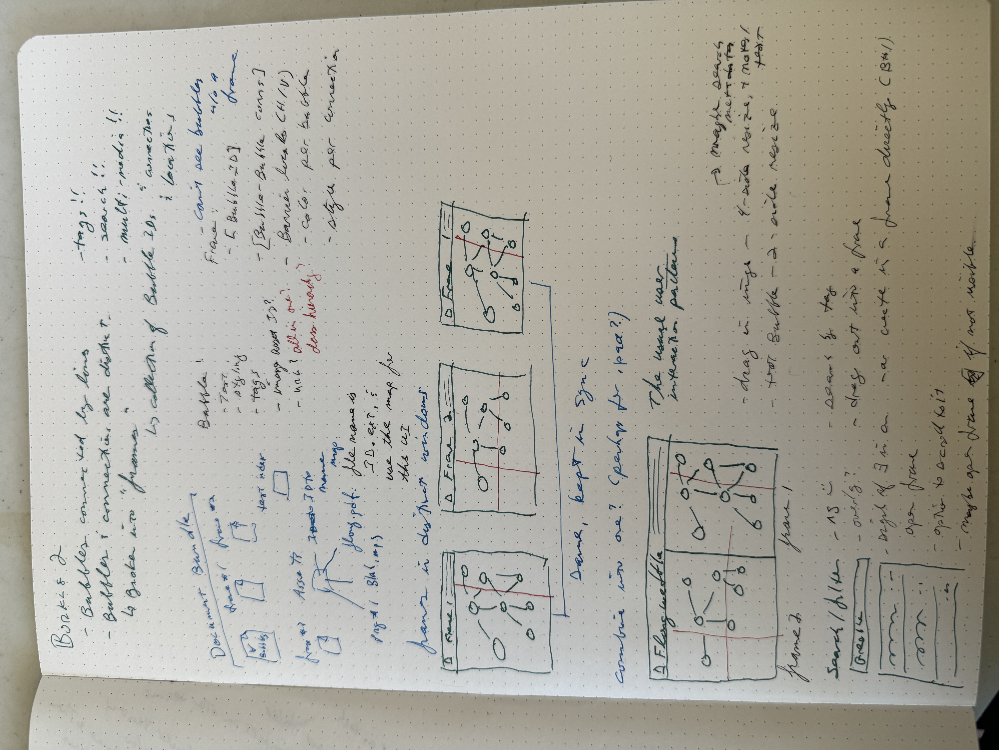

# Borkle2

Borkle TNG The Next Generation

c.f. [Borkle 1](https://github.com/markd2/borkle) - that idea, but with the
ability to store the text bubbles independently of the connections.  Started 
on something like that in the original code base, but the refactor was getting
unpleasant enough, and I'm the only user, so might as well start afresh.

Also, an opportunity to chew through stuff at [Gate.Crash](https://gatecrashatl.com) "uninterrupted".

# Overarching Design

yay pen and paper!

