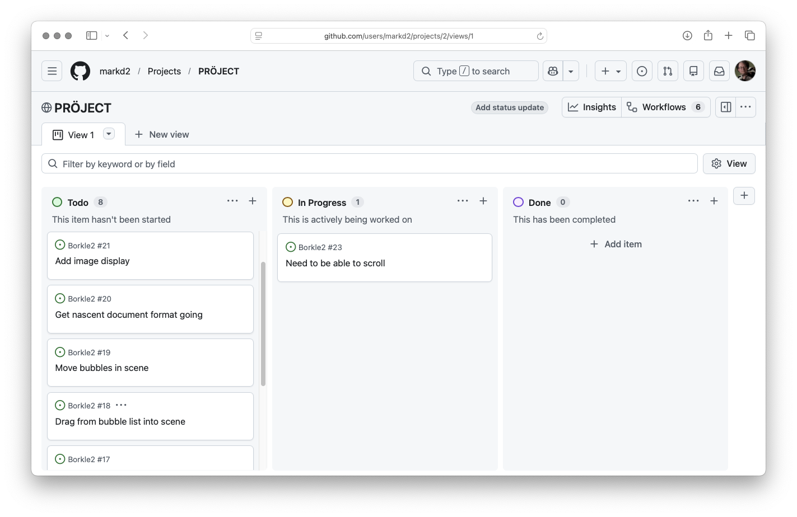

# Use github project

JIRA for all its faults and agglutinized horror, was still pretty useful for "I need to
do this. Future me, you figure it out".

Use Github Projects for tracking that stuff

# Discussion

As much as I love notebooks and fountain pens, they're not great for the day-to-day
"what do we need to do, and how will we do it" tactical thinking.  Having something
electronic and sharable (especially if anyone bored enough to want to work on this
project)

The github project "swimlane" mode seems to be a pretty good fit.  "to do / in progress / done". No need for points, rating, explicit dependencies, or that kind of stuff.  "I feel
like working on Borkle2 today. What is something I can do?"

## Word of warning for folks thinking of doing this

New projects aren't repo-aligned.  My Borkle2 project ended up making issues in the
RandomLearning repo. I had to transfer them one-by-one to this repo, and I think I lost
the labels I had (which in retrospect were kind of overwrought - let's let that kind
of structure be emergent

# Like this

