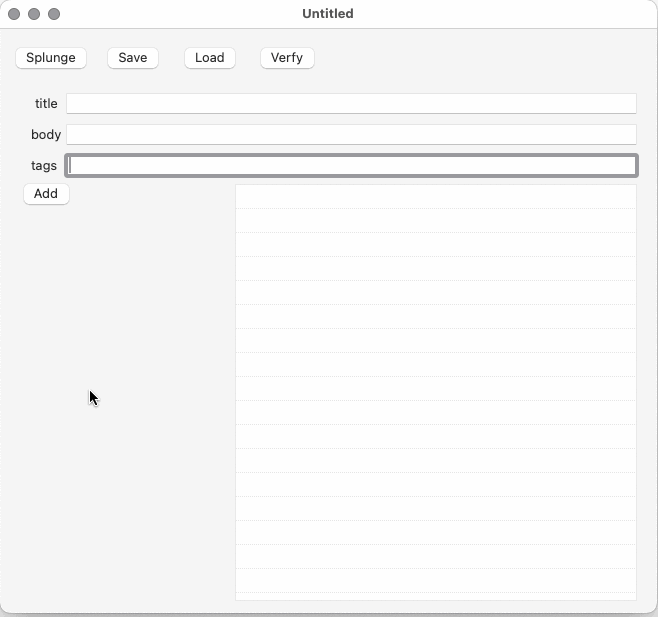
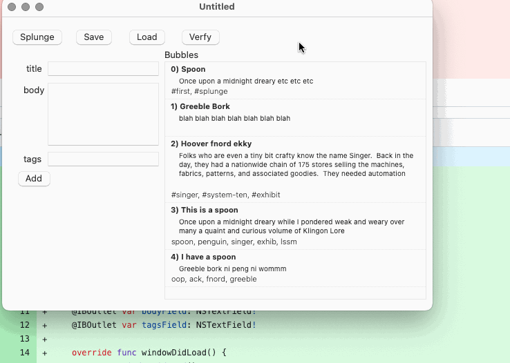
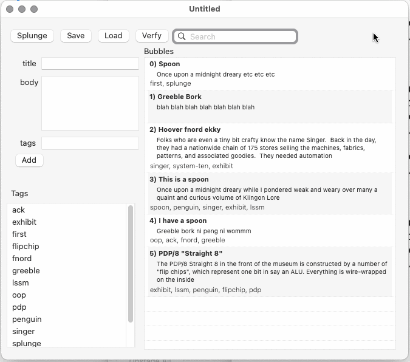
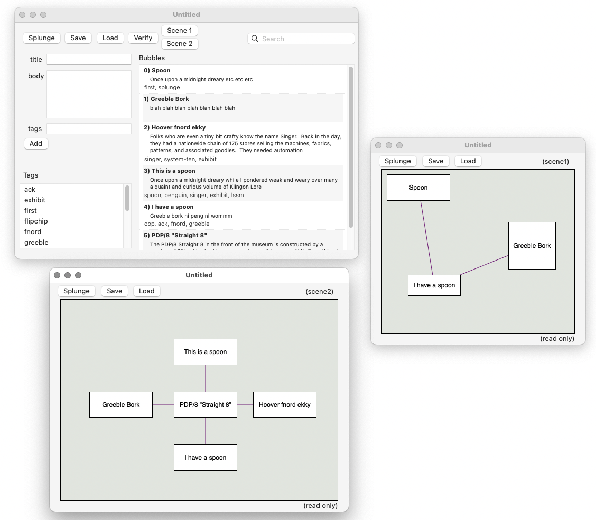
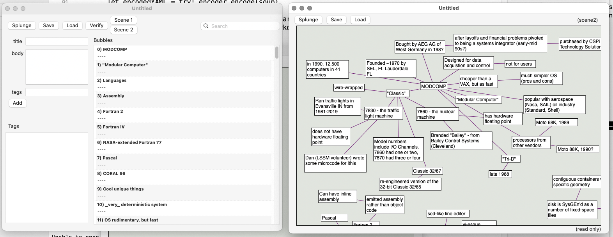
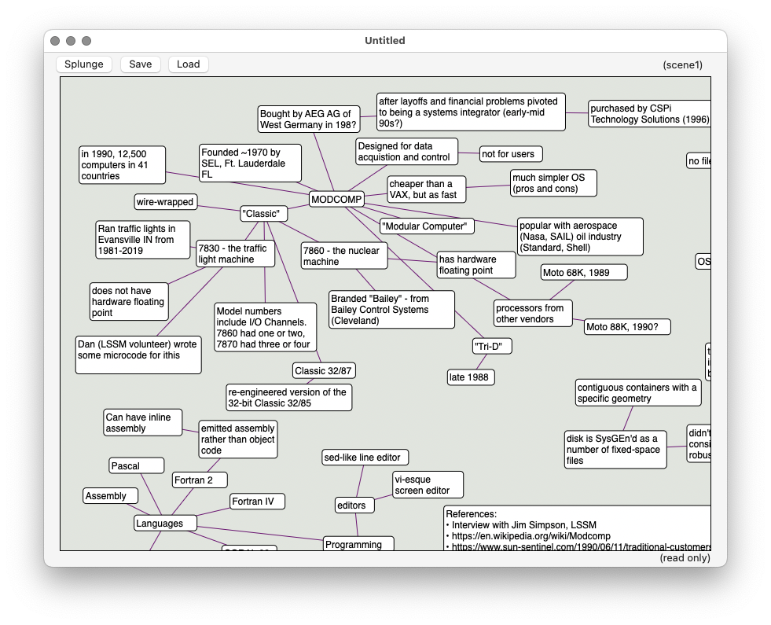
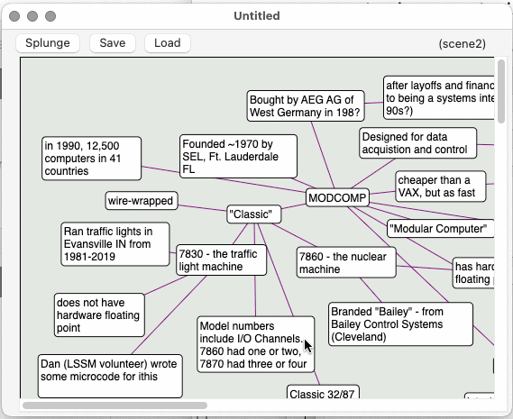
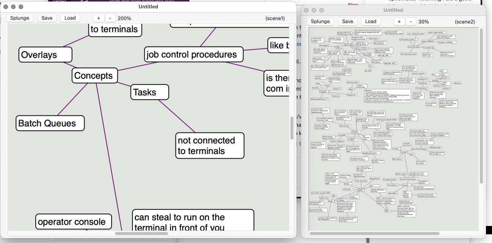

# Apple Platforms

Mac / iOS / iPadOS / iEtcOS as we see fit.

The Mac/AppKit version is the primary one for editing, and where new
features are tried first.

Other apps (and platforms) (will) tend to either treat a generated Borkle 
document as read-only, or give some powered exoskeleton on top of it.

# Progress

bootstrapping basic data structures.  This loads and stores from a fixed
place in the file system, shows bubbles in a table, and lets you enter new
bubbles via a crude form.

Some refaxoring, also dynamically resizes the row height as the tableview resizes..

Adding a search field and a table of tags

Adding scene viewers, and custom scenes drawing from the same pool of bubbles.

Added a converter from borkle 1 documents (incomplete, but good enough for now),
and ran borkle document (modcomp notes) through it.

Made bubbles look a little less bletcherous, and also correctly compute
their height

Scrolling!  Even grab-hand scrolling.

Zooming!  (via buttons)

# Gripes about Borkle-1

* Random scrolling if adding new bubbles to the bottom of the document
  (itself being scrolled).
* in fact, just better "keep a margin around everything" to make adding
  bubbles anywhere easier (perhaps a configuration option)
* would really like a command-= to auto-size bubbles to contents
* would like to cmd-][ to resize while editing

# Features would like

(while using Borkle-1)

* Select bubbles. Rat-click on another and do "array around me".  Might
  just move and not connect.  connecting is easy with a drag since the
  subordinate bubbles are already selected

* have some tags have visual impact. Like a "#huh" for things where I have
  questions about could have a "?" icon in a corner

* maybe the titles are what are entered in bubble mode.  The
  bodies would be longer-winded things that would be the
  actual browsable stuff on other platforms (for the platform
  documentor/viewor setup).  Because there can be multiple scenes,
  totally fine if only a small subset of bubbles had the longer-winded
  descriptions. That'd be in a "delivery" view. And the (a) compiler could
  get rid of bubbles that didn't exist in the delivery view.

* hrm, have bubbles more than once in a scene?  Would be easy to do when
  dragging out from a list.  Maybe a signifier in the list that shows
  if the bubble is in the current (also any?) scene.

* maybe scenes can have cards vs bubbles.  A card references a bubble
  and a geometry. A connection can be between cards instead of bubbles?
  Maybe a card can have its own bubble.  Maybe a card can have formatting
  that gets inherted by bubbles (so say an _Alias_ card could have text be
  in italics)

* voronoi diagram on the canvas background using islands of bubbles as the
  the voronoi cells

  